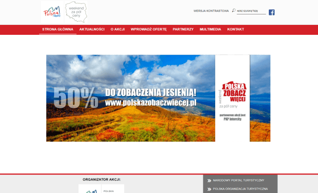

# Polska Zobacz Więcej
Szablon do serwisu [polskazobaczwiecej.pl][1] dla systemu Joomla! 3.7 wykonany na podstawie dotychczasowego szablonu opartego o system WebAdministrator CMS.

Specyficzne cechy szablonu:
* Responsywny;
* Ścisłe dopasowanie do projektu, konkretnych komponentów i rozwiązań (nie jest to uniwersalny szablon):
  * Natywny moduł obsługi bannerów `mod_banners` z automatyczną rotacją typu fade-in-fade-out, gdy wyświetlane są 2-3 bannery w module;
  * Natywne rozszerzenia wyszukiwania: `mod_search` oraz `com_search`;
  * Natywny komponent wyświetlania treści `com_content` (ale tylko widoki `article`, `category`, `featured`);
  * Formularz kontaktowy: rozszerzenie [JU Contact][2].
* Zmiana stosowanej natywnie w Joomli hierarchii nagłówków celem uzyskania większej dostępności;
* Poprawna walidacja WCAG w [walidatorze Wave][3].
* Możliwość aktualizacji bezpośrednio z panelu administracyjnego (pobierany jest najnowszy release z tego repo);
* Wbudowana obsługa przełączenia w tryb wysokiego kontrastu;
* Wbudowana obsługa wyboru wielkości czcionki: mała, średnia, duża;
* Wbudowane wyświetlanie informacji o ciasteczkach.
* Przy włączonym JavaScripcie niektóre funkcjonalności mają usprawnione działanie (np. linki są zamienione na buttony, aby uzyskać czystsze adresy URL; ciasteczka są ustawiane "w locie"); przy wyłączonym wykorzystywane są zwyczajne rozwiązania HTML & CSS.

Informacje dla osób dostosowujących konfigurację serwisu do szablonu:
* Moduł wyszukiwarki: `mod_search` umieszczony w pozycji `header`, ustawienie "Box text" wypełnione stosowną frazą, ukryty tytuł modułu; ustawienia "Search Button" oraz "Search Button Image" nie mają wpływu na działanie modułu.
* Komponent wyszukiwarki: `com_search` z ustawieniem "Created Date" na wartośc "Hide"; szablon deaktywuje mozliwosc sterowania tytulem strony, ktory jest na sztywno ustalony jako "Wyniki wyszukiwania";

Informacje dla osób dostosowujących komponenty do szablonu:
* W trybie wysokiego kontrastu tag `body` ma przypisaną klasę `high-contrast` a zwykłym trybie graficznym `low-contrast`;
* Widok domyślnego menu dla danego języka przypisuje do tagu `body` klasę `frontpage` - pozostałe widoki otrzymują `not-frontpage`.

Tworzone i wykorzystywane ciasteczka:
* `high_contrast` - wartość `1` oznacza włączoną wersję kontrastowej;
* `cookie_law_message` - wartość `1` oznacza włączone wyświetlanie informacji o ciasteczkach;
* `font_resize` - przyjmuje wartości `small`, `medium`, `large` i na ich podstawie zapamiętuje zmianę rozmiaru czcionki.

[1]:http://www.polskazobaczwiecej.pl
[2]:https://extensions.joomla.org/extension/contacts-and-feedback/contact-forms/ju-contact/
[3]:http://wave.webaim.org
